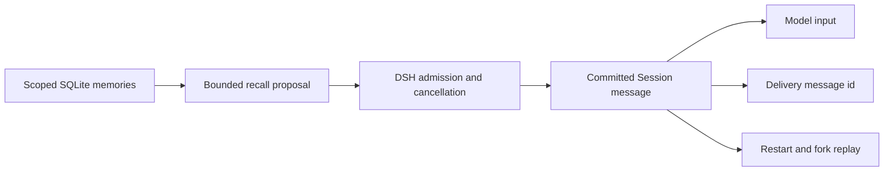

# DSH memory architecture

English | [中文](ARCHITECTURE.zh.md)

The native Bundle adds selected long-term memories to DSH's existing lifecycle. All implementation paths below are relative to `packages/dsh-plugin/`. [STRUCTURE.md](STRUCTURE.md) maps the files; the [package guide](packages/dsh-plugin/README.md) owns user-facing configuration.

## Component ownership

| Component | Source | Responsibility |
|---|---|---|
| Bundle and provider | `cordis.patch.yml`, `src/index.ts`, `src/service.ts` | Compose three rows and own one store connection through Cordis disposal. |
| Memory store | `src/store.ts`, `src/sqlite.ts` | Validate scope, persist revisions and receipts, and serialize atomic writes. |
| Search | `src/normalize.ts`, `src/tokenize.ts` | Encode literal Chinese, identifier, and path terms for bounded FTS5 retrieval. |
| Native tools | `src/tools.ts`, `src/scope.ts` | Derive trusted Session identity and expose remember, recall, update, and forget. |
| Recall consumer | `src/recall.ts` | Propose a bounded snapshot and track delivery through a committed Session projection. |
| Management face | `src/management.ts`, `src/management-wire.ts`, `src/client/` | Reuse the authenticated DSH gateway and existing Web settings surface. |

DSH owns the AgentLoop, model provider, permissions, Session storage/query, and compaction. The plugin has no transcript database, auxiliary model, background timer, or additional server. Client dependencies are optional host peers and the browser factory is built separately from Host JavaScript.

## Admission and recovery

The first eligible request selects complete recent facts within the framing budget. `agent/pre-step` preserves the host's request-series decision. DSH performs cancellation/admission checks before persisting the returned message. The projection is advanced by committed events, so a cancelled proposal remains eligible for a later attempt.

The logged message freezes its content and source metadata. Restart and fork recover the same bytes from the Session log even after a memory is updated or archived. Explicit recall reads current records. Inherited fork messages do not create new memories or a second initial injection. Native DSH compaction may replace conversation history while the delivery receipt remains committed.

The adapter performs no arbitrary synchronous Session-history reads or per-step full-history serialization. Materializing a missing host projection can fold the existing log once. DSH still retains its own Session data; a bounded plugin projection does not imply constant-memory host recovery.

## Storage invariants

The database path defaults to `$DSH_HOME/magic-context/memory.sqlite`. `application_id=0x44534d43` and `user_version=1` identify the unchanged DSH schema. Foreign or future schemas are refused before mutation. File permissions are set to `0600`, WAL mode is enabled, synchronous writes use `FULL`, and mmap is disabled.

| Table | Durable purpose |
|---|---|
| `memories` | Current records, scope, stable id, revision, lifecycle, and provenance. |
| `memory_revisions` | Immutable superseded and archived revisions. |
| `memory_operations` | Request fingerprint and committed result for idempotent retry. |
| `memory_fts` | Literal search tokens for active records. |

Each write enters an immediate transaction. Record, revision, FTS, and receipt changes either commit together or roll back together. Reused request ids with changed arguments fail; stale revisions fail without overwriting current content. Native SQLite savepoints isolate nested work, including when a caller already holds a manual transaction. Closing the provider releases its owned connection and subsequent operations fail.

Workspace identity comes from the Session's canonical real path. A model cannot name another workspace in tool arguments. Global writes require an explicit scope; direct Web edits select only stored workspace identities and retain separate human provenance. Write deduplication preserves case-sensitive identifiers while normalizing whitespace. Search lowercases and normalizes its own indexed terms without changing persisted record content.

## Dependency and resource boundaries

Only `packages/dsh-plugin` is a workspace. The local SQLite wrapper imports `node:sqlite` and uses Node's native types. Exact upstream ancestry for this wrapper, normalization, category vocabulary, and migrated regression cases is in [NOTICE](packages/dsh-plugin/NOTICE); no other package source is needed for compilation or runtime.

The default page cache is 8 MiB, query results are capped, and the initial snapshot defaults to five records within 1,000 estimated tokens. The provider caches a fixed set of SQL statements. Projection state holds only the delivered message id; all snapshot content stays in the log. [Resource gates](docs/dsh/resource-budgets.json) and [specialization evidence](docs/dsh/specialization.md) distinguish measured adapter costs from host RSS and historical source footprint.

## Verification and maintenance

Node tests cover storage failure, retry, revision conflicts, scope, Chinese/mixed retrieval, cancellation, JSONL restart, fork, native compaction, and disposal. The tarball probe verifies runtime loading, local declaration closure, Bundle composition when the CLI is installed, and production JSX imports. Real-model and Web acceptance use an isolated home and the exact artifact under test.

Use the [upstream workflow](UPSTREAM.md) to mirror full source on `origin_main` and selectively port relevant fixes to `dsh_main`. This specialization preserves database and Session formats. Repository rollback reverts specialization commits or checks out the accepted baseline; memory data needs no conversion.
