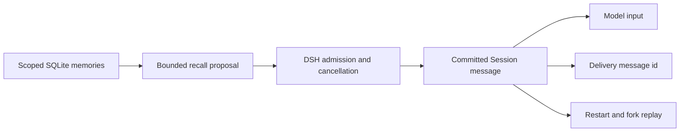

# DSH 记忆架构

[English](ARCHITECTURE.md) | 中文

原生 Bundle 在 DSH 现有生命周期中增加精选长期记忆。下文实现路径均相对于 `packages/dsh-plugin/`。[STRUCTURE.zh.md](STRUCTURE.zh.md) 维护文件归属，[包指南](packages/dsh-plugin/README.zh.md) 维护用户配置。

## 组件归属

| 组件 | 源码 | 职责 |
|---|---|---|
| Bundle 与 provider | `cordis.patch.yml`、`src/index.ts`、`src/service.ts` | 组合三行配置，通过 Cordis 释放机制管理一个存储连接。 |
| 记忆存储 | `src/store.ts`、`src/sqlite.ts` | 校验作用域，保存修订与回执，串行执行原子写入。 |
| 检索 | `src/normalize.ts`、`src/tokenize.ts` | 将中文、标识符和路径字面词项编码为有上限的 FTS5 检索。 |
| 原生工具 | `src/tools.ts`、`src/scope.ts` | 获取可信 Session 身份，提供保存、召回、更新与遗忘。 |
| 召回消费者 | `src/recall.ts` | 提出有预算的快照，通过已提交 Session 投影记录送达。 |
| 管理界面 | `src/management.ts`、`src/management-wire.ts`、`src/client/` | 复用已认证 DSH 网关及现有 Web 设置页面。 |

AgentLoop、模型 provider、权限、Session 存储/查询和压缩由 DSH 管理。插件没有对话数据库、辅助模型、后台定时器或额外服务器。客户端依赖是可选宿主 peer，浏览器 factory 与 Host JavaScript 分别构建。

## 入场与恢复

首个符合条件的请求在包含提示框架的预算内选择完整近期事实。`agent/pre-step` 保留宿主的 request-series 决策，DSH 在保存返回消息前完成取消及入场检查。投影由已提交事件推进，被取消的候选仍可在后续请求中重试。

日志消息冻结内容和来源元数据。记忆被更新或归档后，重启与 fork 仍从 Session 日志恢复相同字节；显式 recall 读取当前记录。fork 继承消息不会创建新记忆或重复初始注入。DSH 原生压缩可以替换对话历史，同时保留已提交的送达回执。

适配器不进行任意同步 Session 历史读取，也不逐步序列化完整历史。宿主首次建立缺失投影时可能折叠一次既有日志。DSH 仍保留自己的 Session 数据，插件投影有界不代表宿主恢复具有常量内存开销。

## 存储约束

数据库默认位于 `$DSH_HOME/magic-context/memory.sqlite`。`application_id=0x44534d43` 和 `user_version=1` 标识保持不变的 DSH schema。修改前拒绝外来库或未来 schema。文件权限为 `0600`，启用 WAL，使用 `FULL` 同步写入，禁用 mmap。

| 表 | 持久化用途 |
|---|---|
| `memories` | 当前记录、作用域、稳定 ID、修订、生命周期和来源。 |
| `memory_revisions` | 不可变的已替代及归档修订。 |
| `memory_operations` | 请求指纹和已提交结果，用于幂等重试。 |
| `memory_fts` | 有效记录的字面检索词项。 |

每次写入进入 immediate 事务。记录、修订、FTS 和回执一起提交或一起回滚。相同请求 ID 携带不同参数会失败，旧修订不会覆盖当前内容。原生 SQLite savepoint 隔离嵌套操作，也支持调用者已开启手动事务的情况。释放 provider 会关闭其连接，之后的操作失败。

工作区身份来自 Session 的规范化真实路径。模型不能通过工具参数指定其他工作区。全局写入需要显式作用域；直接 Web 编辑只能选择已有存储身份，并保留独立人工来源。写入去重保留标识符大小写并归一化空白；检索对自己的索引词项进行小写和归一化处理，不改变已保存记录内容。

## 依赖与资源边界

唯一工作区为 `packages/dsh-plugin`。本地 SQLite 封装导入 `node:sqlite` 并使用 Node 原生类型。该封装、归一化、分类词表及迁移回归用例的精确来源见 [NOTICE](packages/dsh-plugin/NOTICE)，编译和运行均无需其他包目录源码。

默认页缓存为 8 MiB，查询结果有数量上限，初始快照默认为五条记录且不超过 1,000 个估算 token。provider 只缓存固定 SQL 语句集合，投影只保存送达消息 ID，快照内容均在日志中。[资源门槛](docs/dsh/resource-budgets.json)及[兼容性证据](docs/dsh/compatibility.zh.md)分别记录适配器实测成本、宿主 RSS 和历史源码体积。

## 验证与维护

Node 测试覆盖存储失败、重试、修订冲突、作用域、中文/混合检索、取消、JSONL 重启、fork、原生压缩和释放。tarball 验证运行时加载、本地声明闭包、已安装 CLI 时的 Bundle 组合及生产 JSX 导入。真实模型和 Web 验收使用隔离 home 及明确的待测安装包。

通过[上游工作流](UPSTREAM.zh.md)在 `origin_main` 镜像完整源码，向 `dsh_main` 选择性迁入相关修复。本次专用化保留数据库与 Session 格式。仓库回退可 revert 精简提交或检出已验收基线，记忆数据无需转换。
